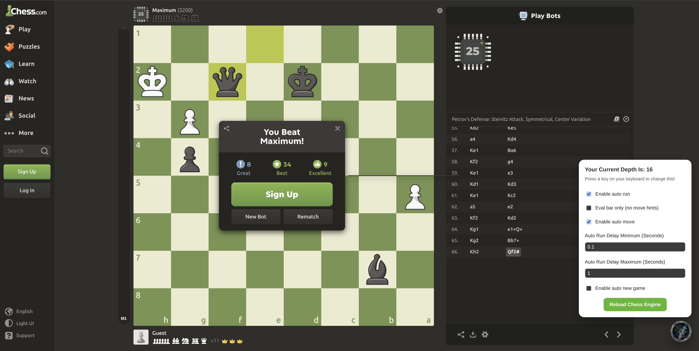
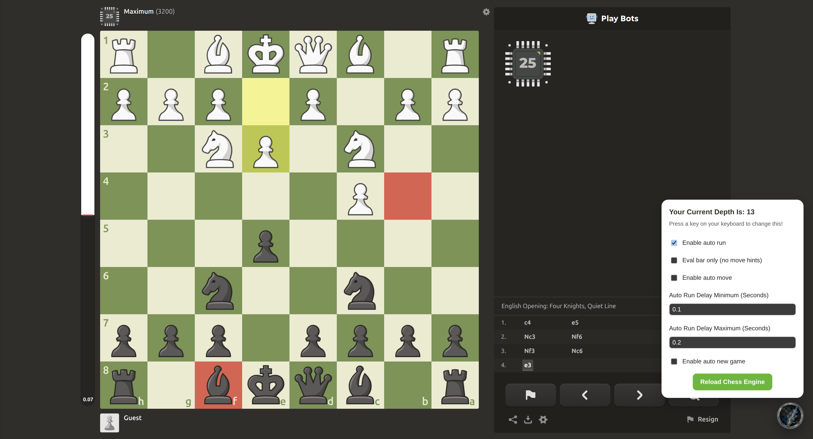
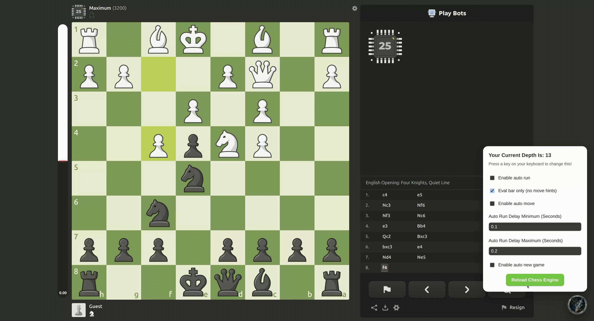
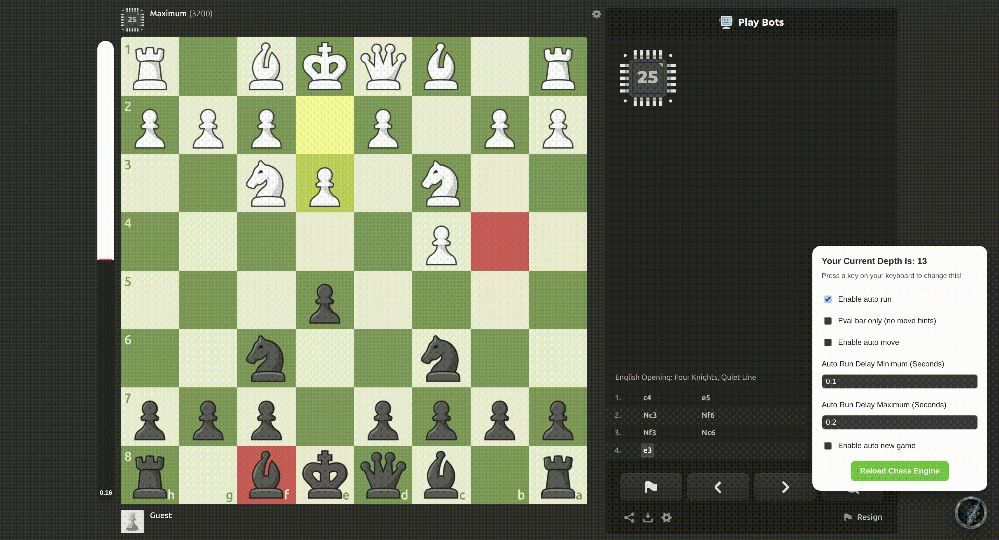

# Chess Bot - Stockfish & LC0

Repository này chứa ba cách sử dụng bot trên Chess.com:

- **Stockfish Chrome Extension**: extension chính với evaluation bar, gợi ý nước đi, phân loại nước đi và auto-move.
- **LC0 Chrome Extension**: extension riêng dùng engine LC0 chạy qua local bridge.
- **Stockfish userscript legacy**: userscript Tampermonkey cũ, giữ lại để tương thích và tham khảo.

## Stockfish Chrome Extension



Chess Bot là extension hỗ trợ phân tích và gợi ý nước đi trên chess.com bằng Stockfish. Mục tiêu là giúp bạn học nhanh hơn, hiểu thế trận rõ hơn và luyện tập hiệu quả với giao diện trực quan.

**Phù hợp cho**

- Người muốn luyện tập và phân tích ván cờ của mình.
- Người mới chơi cần gợi ý nước đi để học nguyên tắc cơ bản.
- Người chơi trung cấp muốn theo dõi đánh giá thế trận (eval bar).

**Tính năng**

- Gợi ý nước đi tốt nhất.



- Thanh đánh giá thế trận dễ hiểu.



- Tự đi theo gợi ý.



- Tùy chỉnh độ trễ để tự nhiên hơn.
- Tự bắt đầu ván mới khi kết thúc (Auto New Game).
- Phân loại nước đi và hiển thị thông tin phân tích.

### Cài đặt

1. Mở Chrome và vào `chrome://extensions`.
2. Bật `Developer mode`.
3. Chọn `Load unpacked` và trỏ tới thư mục `chess-bot-extension`.

### Cách sử dụng

1. Vào `chess.com` và mở một ván chơi hoặc puzzle.
2. Bấm icon extension để bật/tắt toàn bộ.
3. Trên bàn cờ sẽ xuất hiện nút tròn. Bấm để mở bảng điều khiển.
4. Chọn các tùy chọn theo nhu cầu (Auto Run, Eval bar only, Auto Move…).

### Phím tắt độ sâu phân tích

- Phím tắt điều chỉnh depth là các phím trên bàn phím từ `Q` đến `M`, tương đương độ sâu từ 1 - 26.

## Stockfish userscript legacy

Userscript cũ nằm trong `chess_bot.js` và chạy bằng Tampermonkey. Engine Stockfish được lưu trong:

```text
stockfish_engine/171_single_nnue/
```

### Cài đặt

1. Cài Tampermonkey.
2. Tạo một userscript mới.
3. Dán nội dung của `chess_bot.js` vào userscript.
4. Lưu lại rồi truy cập [chess.com/play/computer](https://www.chess.com/play/computer).

### Tính năng

- Tự động tìm nước đi tốt nhất bằng Stockfish 17.1.
- Điều chỉnh độ sâu phân tích.
- Evaluation bar.
- Auto-run và auto-move.
- Auto new game.
- Random delay.

### Điều khiển

- Nhấn phím từ `Q-M` để đặt depth từ 1 - 26.
- Bấm nút tròn ở góc dưới phải để mở hoặc đóng panel.

## LC0 Chrome Extension

LC0 extension nằm trong `lc0-bot-extension/`. Phần extension giao tiếp với một local FastAPI bridge, sau đó bridge điều khiển binary `lc0` qua UCI.

### Chuẩn bị và chạy local bridge

Yêu cầu Python 3.11 trở lên và `uv`:

```bash
pip install uv
cd lc0-bot-extension/bridge
uv sync
uv run uvicorn app.main:app --host 127.0.0.1 --port 3187 --workers 1
```

Trước khi chạy, kiểm tra `lc0-bot-extension/bridge/lc0.config` và đặt đường dẫn weights phù hợp với máy của bạn. Có thể dùng file `.env` dựa trên `.env.example` để cấu hình đường dẫn binary, port và thời gian tìm kiếm.

### Cài đặt LC0 extension

1. Mở Chrome và vào `chrome://extensions`.
2. Bật `Developer mode`.
3. Chọn `Load unpacked`.
4. Trỏ tới thư mục `lc0-bot-extension/extension`.
5. Đảm bảo local bridge đang chạy ở `http://127.0.0.1:3187`.

LC0 hỗ trợ các chế độ tìm kiếm `classic`, `policyhead` và `valuehead`. Các thiết lập thời gian tìm kiếm, random delay, Auto Run và Auto Move được điều chỉnh trong panel của extension.

## Lưu ý

- Hãy tuân thủ quy định Fair Play của Chess.com.
- Chỉ sử dụng cho mục đích học tập, phân tích và luyện tập cá nhân.
- Tránh sử dụng trong các ván xếp hạng hoặc giải đấu trực tuyến.
- Tác giả không chịu trách nhiệm về việc tài khoản bị hạn chế hoặc khóa.

Sử dụng bot có trách nhiệm.
